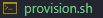
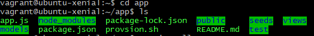
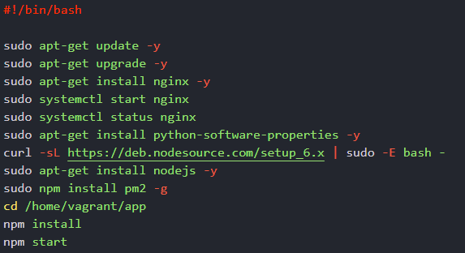

# App deployment
>Pre-requisites: Ruby, Git Bash, Vagrant, VirtualBox
1. Download, unzip and move the **app** and **environment** folders into your chosen folder
2. Make a Vagrant file(make sure you are in the same directory):
```bash
vagrant init
```
3. Populate your  file with the following ruby code:
```ruby
Vagrant.configure("2") do |config|
  
  # configures the VM settings
  config.vm.box = "ubuntu/xenial64"
  config.vm.network "private_network", ip:"192.168.10.100"

  # provision the VM to have Nginx installed
  config.vm.provision "shell", path: "provision.sh"

  # Syncs the "app" folder to the "/home/vagrant/app" location on the VM, changes on either will affect the other.
  config.vm.synced_folder "app", "/home/vagrant/app"
  
end
```
4. Make a  file and populate it with the following commands:
```bash
#!/bin/bash

# Updating the linux environment
sudo apt-get update -y
sudo apt-get upgrade -y

# Installing and starting nginx
sudo apt-get install nginx -y
sudo systemctl start nginx
sudo systemctl status nginx
```
# Downloading the dependencies:
1. Open  as administrator (make sure you are in the right directory) and then enter the linux VM:
```bash
vagrant ssh
```
2. To confirm everything is set up correctly type
```bash
ls
```
you should see 
<p align=center>

</p>
then type: 
```bash
cd app
```
and you should see: 

Now exit again by typing: 
```bash
cd ..
```
3. Now we need to install some dependencies first lets install some python packages: 
```bash
sudo apt-get install python-software-properties -y
```
4. Next let us get the version of nodejs we need from the internet
```bash
curl -sL https://deb.nodesource.com/setup_6.x | sudo -E bash -
```
You will get this warning, just ignore: 
<p align="center">

</p>

Then install the downloaded nodejs packages:
```bash
sudo apt-get install nodejs -y
```
5. Finally we need some pm2 packages :
```bash
sudo npm install pm2 -g
```
>Note: -g is a global tag (pm2 available globally)

6. Change directory to the app folder:
```bash
cd /home/vagrant/app
```


7. Then we install all modules from nodejs code:
```bash
npm install
```
>Note: npm is the package manager for nodejs
8. Then we need to start the application:
```bash
npm start
```
or 
```bash
node app.js
```

You should see the following after, meaning that you have launched the application successfully:
<p align="center">

</p>

1. You can see if the app si running by visiting http://192.168.10.100:3000/ where you should see something similiar to :
<p align="center">

</p>

Optional: If you want to use the provided tests then run the following lines in your vscode bash:
```bash
cd eniveronment
cd spec-tests
gem install bundler
bundle
rake spec
```


# Full automaation
1. To fully automate this process, you should just input all the code above into your  : 
```bash
sudo apt-get install python-software-properties -y
curl -sL https://deb.nodesource.com/setup_6.x | sudo -E bash -
sudo apt-get install nodejs -y
sudo npm install pm2 -g
cd /home/vagrant/app
npm install
npm start
```
So in total your code should look like this:


